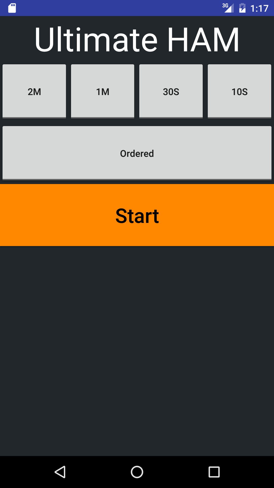
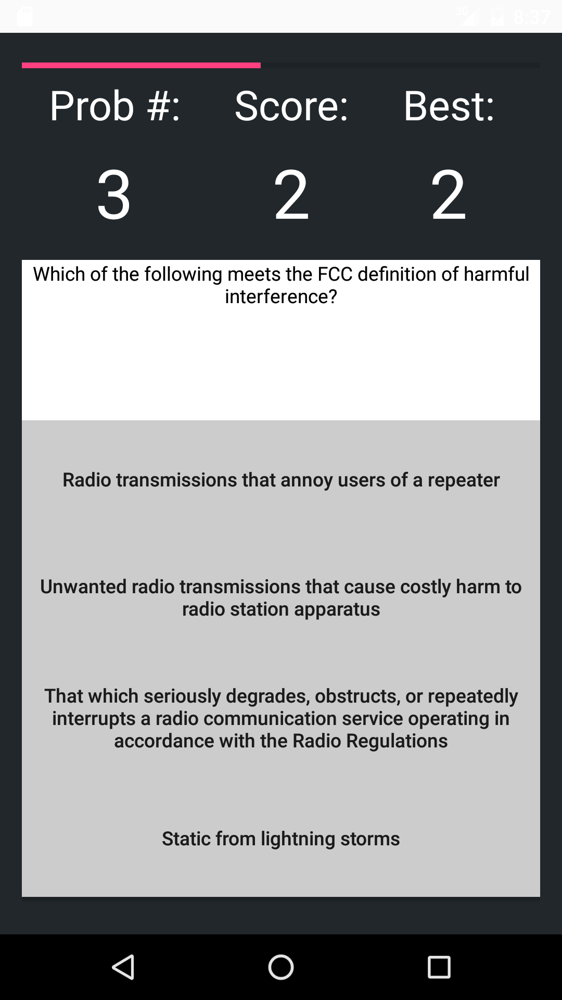
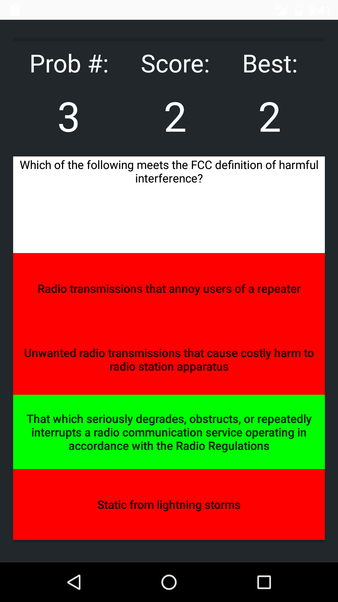

# Ultimate HAM Prep Android Application
I created this application to try my hand at creating Android apps as I was studying for my Technician Class Amature Radio Licance. 
The purpose of this app was to create a timmed version of a HAM study prep app. This app has been deployed on the app store, it can be downloaded and tested here:  
https://play.google.com/store/apps/details?id=com.tylerburnham42.ultimateHAMPrep&hl=en 

## Getting Started
These instructions will get you a copy of the project up and running on your local machine for development and testing purposes.

### Prerequisities
This app was created and deployed using the following software:  
Android Studio 2.1.2
Nexus 5X

### Installing
Clone the Git Repo to your local machiene. Open the project in android studio. Either install a simulator or plugin a supported phone. Click Run.

## Contributing

Please read [CONTRIBUTING.md](CONTRIBUTING.md) for details on our code of conduct, and the process for submitting pull requests to us.

## Versioning

For the versions available, see the [tags on this repository](https://github.com/tylerburnham42/Android-Ultimate-HAM-Prep/tags). 

## Authors

* **Tyler Burnham** - *Initial work* - [tylerburnham42](https://github.com/tylerburnham42)

See also the list of [contributors](https://github.com/tylerburnham42/Android-Ultimate-HAM-Prep/contributors) who participated in this project.

## License

This project is licensed under the MIT License - see the [LICENSE.md](LICENSE.md) file for details

